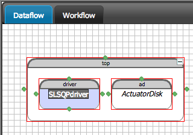
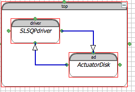
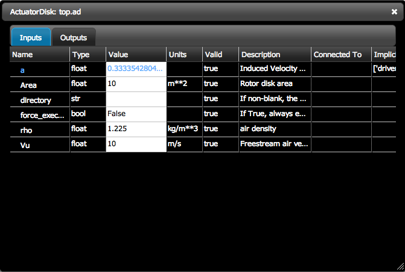
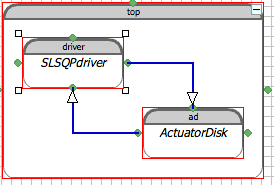

Unconstrained Optimization for Betz Limit
=============================================================

Setting up the Assembly
-----------------------

Start a new OpenMDAO GUI project from the project screen. You can name it whatever you want, but we're going to 
call it ``Betz Limit``. Once the project opens up, filter the library with ``nrel`` and you should see all the
classes for this tutorial. Add an instance of ``actuator disk`` from the libarary to the assembly called ``top``.
We named our instance ``ad``.  

Now you've added a component instance into the top assembly. But you can't do much with it, except set the inputs 
and run that component. To set up an optimization, you need to add in a different driver. So filter the library with 
``opt`` to see a list of optimizers. We're going to start with ``SLSQPdriver`` for this tutorial. Drag an instance of 
SLSQPdriver over to the top assembly, and drop it on top of the RunOnce driver that's already there. You should 
see the driver highlight in blue when you're hovering over it. When you drop on top of an existing component you're 
replacing that component, rather than creating a new one. 

.. _`relace_driver`:

   Replacing something by dropping on top of it

Configure the Optimization
---------------------------
Once you have the SLSQPdriver instance in there, you're ready to configure the optimization. Double click on the driver
to bring up its editor window. You should see a few tabs in that window: 
* Inputs
* Parameters
* Trigger 
* Outputs
* Objectives
* Workflow
* Slots
* Constraints
The inputs and the outputs tabs contain variables that are specific to the driver. These could be for settings specific to the 
optimizer or for framework variables like execution count. To set up the optimization we'll look at the Parameters and Objectives tabs
first.

We're going to set up an optimization to look for Betz's limit. This is a we'll known result that states that for a wind turbine, as you try 
to exract more and more velocity from the incoming wind the best
you can do is to extract about 60% of the power from the wind. This result comes from an analysis of the equations used to build 
our ActuatorDisk component. We'll try to use an optimizer to confirm that our component returns the right value for Betz's limit. First 
open the parameters tab. Click on the ``add parameter`` button. A small dialog will open up that lets you specify which parameter you want 
to give to the optimizer. If you hit the down arrow, you will get a list of all the available variables. Pick ``ad.a``. This is the 
axial induction factor, or a ratio of the incoming wind velocity to the velocity after it exits the turbine. You'll notice that when you 
picked that variable, the low and high were automatically filled in for you. These came from the variable metadata which specified a low and a
high of 0 and 1 respectively. You could shrink these ranges if you wished, but not expand them. 0 and 1 are hard limits set by the component that 
can't be violated. We'll leave them as is. You will also notice the optional ``scaler``, ``adder`` fields. These are available 
for you to scale and shift your parameter if necessary to give a more stable optimization. Once you hit ``ok``, you should see the dataflow 
diagram change a bit. The blue connector that showed up indicates that there is an implicit connection between the driver and the component. 
The connection is implicit because the driver will set the value of `ad.a` during the optimization, but that you can also change the value. 
Whatever you set the value to will be used as the initial condition for the optimization. 

If you double click on ad instance now, 
you will see that the ``a`` variable in the editor window is also highlighted in blue. All variables with impicit connections will be
showin in blue. 

We also need to specify an objective. Go to the objective tab and click ``add objective``. Optimizers by default will 
try to minimize the objective, so set the objective to ``-ad.Cp`` to get a maximization. You'll see a new feedback connector 
show up in the dataflow when you do this. This indicates that the optimizer is now dependent on values from the component. 

