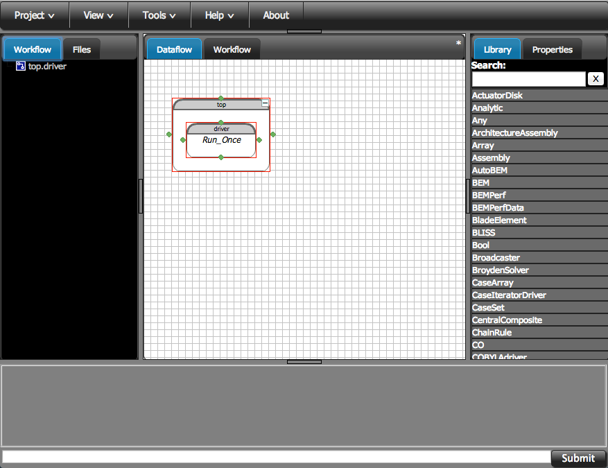

===========
Usage Guide
===========

This plugin contains the documentation and component definitions for the OpenMDAO Class was given at the 2013 National Renewable 
Energy Laboratory (NREL) Wind Energy Systems Engineering workshop. The class was given by Justin Gray and Chris Heath 
from the NASA Glenn Research Center. Justin and Chris are members of the OpenMDAO development effort, and built the 
content of this class to demonstrate the basic usage of OpenMDAO with the GUI with some simple wind turbine design 
problems. The class covers: 
* basic usage for creating basic components
* instantiating those components in the GUI to build simple models
* building optimizations around models, working with design of experiments
* recording data from your runs
* building more complex models

You'll need OpenMDAO Version 0.4.2 or later to work with this tutorial. 

Opening the GUI
==================

OpenMDAO ships with a web-browser-based Graphical User Interface. Our GUI is written in Javascript and HTML. 
Even though the GUI is rendered in a web browser, you don't need to be connected to the Internet to use it. OpenMDAO is delivered 
with the GUI built in. So once you've installed OpenMDAO, just open up a command window, 
`activate <http://openmdao.org/docs/getting-started/install.html>` your OpenMDAO environment, and then 
type: 

:: 

  openmdao gui

Two things should happen next. First, you should see a couple of lines output to the console that looks similar to the following: 

:: 
    
  Opening URL in browser: http://localhost:59499 (pid=74061)
  Opened in open
  <<<74061>>> OMG -- Serving on port 59499

The port number after ``http://localhost:`` and the process id after ``pid=`` will be different
every time you open the GUI, so don't worry if your numbers don't match the ones we show here. 

Second, the Chrome web-browser (You did install a recent version of Chrome, right?) will pop up with a page showing a list of 
all your OpenMDAO projects that the GUI knows about. If this is your first time using the GUI, even if you've been 
using OpenMDAO for a while now, there won't be any projects in the list yet. You have to create new GUI projects for any
existing models.

GUI Basics
=============================================================

Start by creating a new project in the OpenMDAO GUI. If you've never used the OpenMDAO GUI before, you'll be greeted by 
an empty projects page like this: 

.. _`empty-project-page`:

.. figure:: empty_project_page.png
   :align: center

   Initial projects page for the GUI

Start by creating a new project. We'll name it ``actuator_disk``. You don't have to specify any description or 
version information if you don't want to. Only the project name field is required. 

.. figure:: new_project_modal.png
    :align: center

    New project creation dialog

When you first open any new project, you'll see a mostly empty setup with an assembly already created for you. 
We always create a default assembly called ``top``, and all assemblies always start out with a RunOnce Driver instance
called "driver". The name ``driver`` is significant to assemblies. When you tell an assembly to run, it always looks for 
"driver" to start the process. 

    Initial OpenMDAO project view

So the first thing we will do is create a new file to put some code in to define out new actuator disk component. 
Click on the files tab, and then right click to open a context menu. Selet ``New File``, and enter a name for the new 
file. Let's call it ``actuator_disk.py``. (note that the file extension is imporant, so make sure you add the ``.py``)
Now double click in the newly created file in the file tree. This will open the GUI text editor in a new tab. If you don't 
see the text editor come up, check to make sure your pop up blocker did not block it. If it did, you might need to add an exception for the 
GUI to your pop up blocker. With the text editor open, you're ready to build your first OpenMDAO Component class. 

If you had some files on your computer that you wanted to use, you can upload them to the project in a similar way. In the ``File`` tab, 
right click to get to the context menue and select ``Add Files``. Then select the files you want to add from your computer they will 
be uploaded to the GUI. Once you have uploaded these files, they get stored in your OpenMDAO project. If you make any changes to the local 
files, those changes won't be reflected in the GUI project. You would have to make the changes in the GUI, or delete and re-upload the 
files to have the changes take effect. 

Building a Component - Actuator Disk
=============================================================

A component takes a set of inputs and operates on them to produce a set of
outputs. In the OpenMDAO framework, a class called *Component*
provides this behavior. Any Component has inputs and outputs and
contains a function called *execute* that calculates the outputs based on the
values of the inputs. Let's take a look at how you would implement the
actuator disk analysi as an OpenMDAO component:

.. testcode:: simple_component_actuatordisk

    from openmdao.main.api import Component
    from openmdao.lib.datatypes.api import Float

    class ActuatorDisk(Component):
        """Simple wind turbine model based on actuator disk theory"""

        #inputs
        a = Float(.5, iotype="in", desc="Induced Velocity Factor", low=0, high=1)
        Area = Float(10, iotype="in", desc="Rotor disk area", units="m**2", low=0)
        rho = Float(1.225, iotype="in", desc="air density", units="kg/m**3")
        Vu = Float(10, iotype="in", desc="Freestream air velocity, upstream of rotor", units="m/s")

        #outputs
        Vr = Float(iotype="out", desc="Air velocity at rotor exit plane", units="m/s")
        Vd = Float(iotype="out", desc="Slipstream air velocity, dowstream of rotor", units="m/s")
        Ct = Float(iotype="out", desc="Thrust Coefficient")
        thrust = Float(iotype="out", desc="Thrust produced by the rotor", units="N")
        Cp = Float(iotype="out", desc="Power Coefficient")
        power = Float(iotype="out", desc="Power produced by the rotor", units="J")

        def execute(self):
            #we use 'a' and 'V0' a lot, so make method local variables

            a = self.a
            Vu = self.Vu

            q = .5*self.rho*self.Area*Vu**2

            self.u1 = Vu*(1-2 * a)
            self.u = .5*(self.Vu + self.Vd)

            self.Ct = 4*a*(1-a)
            self.thrust = self.Ct*q

            self.Cp = self.Ct*(1-a)
            self.power = self.Cp*q*self.Area

In Python, a class or function must be imported before it can be used. Most of what you need in OpenMDAO
can be imported from: ``openmdao.main.api`` and the ``openmdao.lib`` api modules: 
``openmdao.lib.caseiterators.api``, ``openmdao.lib.caserecorders.api``,
``openmdao.lib.components.api``,  ``openmdao.lib.datatypes.api``, ``openmdao.lib.doegenerators.api``,
``openmdao.lib.drivers.api``, and ``openmdao.lib.surrogatemodels.api``.

The first two lines in the ``actuator_disk.py`` module import the definitions
of the Component class and the Float class. ``Component`` is the base class
that you inherit from to build the ActuatorDisk class. Since all the inputs 
for this model are floats, you only need the ``Float`` variable type for this work.
There are a full compliment of other variable types available in openmdao. You can see
the details on the others `here <http://openmdao.org/docs/basics/variables.html>`_

.. testcode:: simple_component_pieces

    from openmdao.main.api import Component
    from openmdao.lib.datatypes.api import Float
    
There are many other objects you could import from ``openmdao.main.api`` and ``openmdao.lib.datatypes.api``, but you
only import the classes that you need for your particular component to keep things neater. In other words:

.. testcode:: package

    # BAD
    from openmdao.main.api import *
    
    # INCONVENIENT
    import openmdao.main.api
    
    # GOOD
    from openmdao.main.api import Component

The next line defines a class called *ActuatorDisk:*

.. testcode:: simple_component_pieces

    
    class ActuatorDisk(Component):
        """Simple wind turbine model based on actuator disk theory"""
    
.. index:: classes, functions

You define the ActuatorDisk class by deriving it from the Component class. All of your analyses 
will derive from the Component class and typically there are just two functions that you
provide -- one for initialization (anything that needs to be set up once) and one to execute the
component (calculate the outputs from the inputs.)

Right now, your paraboloid class is defined but has no inputs, no 
outputs, and an ``execute`` function that does nothing. So the next thing you need
to do is define the inputs and outputs in the class definition
by adding these lines:

.. testcode:: simple_component_pieces

        #inputs
        a = Float(.5, iotype="in", desc="Induced Velocity Factor", low=0, high=1)
        Area = Float(10, iotype="in", desc="Rotor disk area", units="m**2", low=0)
        rho = Float(1.225, iotype="in", desc="air density", units="kg/m**3")
        Vu = Float(10, iotype="in", desc="Freestream air velocity, upstream of rotor", units="m/s")

        #outputs
        Vr = Float(iotype="out", desc="Air velocity at rotor exit plane", units="m/s")
        Vd = Float(iotype="out", desc="Slipstream air velocity, dowstream of rotor", units="m/s")
        Ct = Float(iotype="out", desc="Thrust Coefficient")
        thrust = Float(iotype="out", desc="Thrust produced by the rotor", units="N")
        Cp = Float(iotype="out", desc="Power Coefficient")
        power = Float(iotype="out", desc="Power produced by the rotor", units="J")

.. index:: Traits

In Python, all objects have *attributes*, but making all of those attributes
visible to the framework would be overwhelming, so OpenMDAO requires you to
declare what we call *Variables* to indicate the specific inputs and outputs
that you want your component to make available to other components. Variables
are usually declared in the class definition of a component.

In this example, all of your inputs and outputs are floating point numbers, so
you will use a type of variable called *Float*. The Float constructor contains
a default value and some arguments. 

The argument *iotype* declares this variable as an input or an output. This
argument is required. If it is omitted (or misspelled), then the variable
won't be visible in the framework.

The optional argument *desc* contains a description, or a string of text that describes this
variable. This argument, while not required, is encouraged.

The optional argument *units* specifyies (if applicable) the physical units the value should have. 
If given, OpenMDAO will perform automated unit checking and, if possible, conversion when a 
variable with units is connected to another variable. 

Finally, you need a function to execute this component:

.. testcode:: simple_component_Paraboloid_pieces

    def execute(self):
            #we use 'a' and 'V0' a lot, so make method local variables
            a = self.a
            Vu = self.Vu

            q = .5*self.rho*self.Area*Vu**2

            self.u1 = Vu*(1-2 * a)
            self.u = .5*(self.Vu + self.Vd)

            self.Ct = 4*a*(1-a)
            self.thrust = self.Ct*q

            self.Cp = self.Ct*(1-a)
            self.power = self.Cp*q*self.Area
        
The ``execute`` function is where you define what a component does when it runs.
The input and output variables are attributes of the ActuatorDisk class, which means that
they must be accessed using *self*. For example, ``self.a`` gives you the value
stored in a. This ``self.`` can be cumbersome if you use it a lot, so you might 
find it convinent to create a couple of function local variables as shortcuts. 
We do this with ``a`` and ``Vu``. 

Often, you will already have the code for evaluating your component outputs,
but it will be in some other language, such as Fortran or C/C++. The `Plugin-Developer-Guide <http://openmdao.org/docs/plugin-guide/index.html>`_ 
gives some examples of how to incorporate these kinds of components into OpenMDAO.

To make sure this component works, try running it. Close the text editor window, and go back to the main 
GUI screen. On the right hand side of the window, there is a tab called ``Library``. 
You can use the Library tab to navigate the list of all available classed in your current 
working environemnt. The libarary will include everything from the OpenMDAO standard 
library, everything from any plugins you have installed, and anything from the files in your current project. 

A Basic Model with the Actuator Disk Component
=============================================================

Unconstrained Optimization for Betz Limit
=============================================================

Recording Data from your Runs
=============================================================
Drivers and CaseRecorders
-------------------------------------------------------------

CSV Case Recorder
-------------------------------------------------------------

DB Case Recorder
-------------------------------------------------------------

More Complex Wind Turbine Model - BEM Theory
=============================================================

